<p align="center">
  
  
  
  
</p>

# 🛡️ TrustGate

### Escrow & AI Arbitration Layer for Autonomous Agent Economies

> **The trust layer between AI agents that pay each other.** When one agent pays another to perform a task, TrustGate locks the funds in an on-chain escrow, verifies the result with an independent AI arbiter, and only releases payment if the work is done right.

---

## 🧠 The Problem

Autonomous AI agents are starting to transact with each other — booking flights, fetching data, executing trades. But there's a critical trust gap:

```
Agent A pays $1 USDC → Agent B
Agent B returns: "Done! ✅"

Did Agent B actually do the work? Who decides?
```

Without a neutral judge, **the buyer has no recourse** and the seller has no incentive to deliver quality. Traditional escrow requires human intervention. We need something automated, trustless, and intelligent.

## 💡 The Solution

TrustGate acts as an **HTTP proxy with built-in escrow and AI arbitration**. Any agent can route requests through TrustGate using standard HTTP headers:

```http
POST https://trustgate.ai/api/proxy
X-Target-URL: https://ai-travel-agent.com/book-flight
X-Escrow-Amount: 1000000
X-Quality-Criteria: "Must return a valid PNR booking code"
```

**What happens under the hood:**

| Step | Action | Component |
|------|--------|-----------|
| 1️⃣ | Buyer agent sends request with x402 payment | `pinion-os` SDK |
| 2️⃣ | TrustGate verifies payment, locks USDC in smart contract | `TrustGateEscrow.sol` |
| 3️⃣ | Request is forwarded to the seller's API | Express Proxy |
| 4️⃣ | Seller's response is evaluated by AI against quality criteria | Trinity AI Arbiter |
| 5️⃣ | Based on verdict: funds go to seller ✅, back to buyer ❌ | Smart Contract |

The whole flow is **autonomous, on-chain, and zero-trust**.

---

## 🏗️ Architecture

```mermaid
sequenceDiagram
    participant B as 🤖 Buyer Agent
    participant TG as 🛡️ TrustGate Proxy
    participant SC as ⛓️ Escrow Contract
    participant S as 🔧 Seller API
    participant AI as 🧠 AI Arbiter (Trinity)

    B->>TG: POST /api/proxy + headers
    TG-->>B: 402 Payment Required (x402)
    B->>TG: x402 USDC payment via Pinion OS
    TG->>SC: createEscrow(seller, 1 USDC)
    Note over SC: 💰 USDC locked in contract
    TG->>S: Forward HTTP request
    S-->>TG: Task result (JSON/text)
    TG->>AI: evaluate(task, criteria, result)
    AI-->>TG: {score: 95, verdict: "approve"}
    
    alt Score ≥ 50 → Approve
        TG->>SC: resolveApprove() → USDC → Seller ✅
    else Score < 50 → Reject
        TG->>SC: resolveRefund() → USDC → Buyer ❌
    end
    
    TG-->>B: Result + Verdict + Tx Hash
```



---

## 🧩 Tech Stack

| Layer | Technology | Purpose |
|-------|-----------|---------|
| **Payment Protocol** | [x402](https://www.x402.org/) / Pinion OS | HTTP-native micropayments |
| **Smart Contract** | Solidity + OpenZeppelin | On-chain USDC escrow with 3-way resolution |
| **Blockchain** | Base Sepolia (Coinbase L2) | Fast, cheap transactions |
| **AI Arbiter** | OpenRouter (Trinity AI) | Independent quality evaluation |
| **Backend** | Express + TypeScript | Proxy server, orchestration |
| **Frontend** | React + Vite | Real-time dashboard with WebSocket feed |

---

## 📂 Project Structure

```
trustgate/
├── contracts/              # Solidity smart contracts
│   └── TrustGateEscrow.sol # Core escrow with approve/refund/partial
├── server/                 # Express backend
│   └── src/
│       ├── index.ts        # Proxy endpoint, x402 middleware, WebSocket
│       ├── arbiter.ts      # Trinity AI evaluation engine via OpenRouter
│       ├── contract.ts     # Ethers.js contract interactions
│       └── config.ts       # Environment configuration
├── client/                 # React frontend
│   └── src/
│       └── App.tsx         # Live dashboard with escrow feed
└── package.json            # Monorepo with npm workspaces
```

---

## 🚀 Getting Started

### Prerequisites

- Node.js v18+
- Base Sepolia wallet with ETH (gas) + USDC ([Circle Faucet](https://faucet.circle.com/))
- [OpenRouter API Key](https://openrouter.ai/)

### Installation

```bash
git clone https://github.com/YOUR_REPO/trustgate.git
cd trustgate
npm install
```

### Configuration

Create a `.env` file in the root:

```env
# Blockchain
TRUSTGATE_PRIVATE_KEY=0xYOUR_PRIVATE_KEY
ESCROW_CONTRACT_ADDRESS=0x19617F4170fC1F3d4c053333586aBEf8efd54052
SELLER_WALLET_ADDRESS=0xSELLER_ADDRESS
USDC_ADDRESS=0x036CbD53842c5426634e7929541eC2318f3dCF7e
BASE_SEPOLIA_RPC=https://sepolia.base.org

# x402
X402_FACILITATOR_URL=https://www.x402.org/facilitator

# AI
OPENROUTER_API_KEY=YOUR_OPENROUTER_KEY

# Server
PORT=4021
WS_PORT=4022
```

### Run

```bash
npm run dev
```

Open **http://localhost:5173** — enter a Base Sepolia private key and hit **Good Quality Demo**.

---

## 🎮 Demo Modes

The dashboard includes 2 demo scenarios that demonstrate the full protocol flow with real on-chain transactions:

| Demo | Mock Seller Response | AI Score | Escrow Resolution |
|------|---------------------|----------|-------------------|
| ✅ **Good Quality** | Excellent delivery with confirmation code | 85-100 | `resolveApprove()` → Seller gets paid |
| ❌ **Bad Quality** | Bought a bus ticket instead of a flight | 0-20 | `resolveRefund()` → Buyer refunded |

Each demo triggers a **real x402 payment**, creates an **on-chain escrow**, and finalizes with a **verifiable Base Sepolia transaction**.

---

## 🔗 Deployed Contracts

| Contract | Address | Network |
|----------|---------|---------|
| TrustGateEscrow | [`0x19617F4170fC1F3d4c053333586aBEf8efd54052`](https://sepolia.basescan.org/address/0x19617F4170fC1F3d4c053333586aBEf8efd54052) | Base Sepolia |
| USDC (Testnet) | [`0x036CbD53842c5426634e7929541eC2318f3dCF7e`](https://sepolia.basescan.org/address/0x036CbD53842c5426634e7929541eC2318f3dCF7e) | Base Sepolia |

---

## 🛣️ Roadmap

- [ ] **Proof-of-Work verification** — verify seller actions via external APIs (e.g. airline PNR lookup)
- [ ] **Multi-arbiter consensus** — multiple AI models vote on quality
- [ ] **Reputation system** — on-chain seller scores based on historical verdicts
- [ ] **SDK for agents** — `npm install trustgate-sdk` for easy integration
- [ ] **Mainnet deployment** — Base mainnet with real USDC

---

## 📜 License

MIT

---

<p align="center">
  Built with 🧠 for the <strong>Pinion OS Hackathon</strong>
</p>
